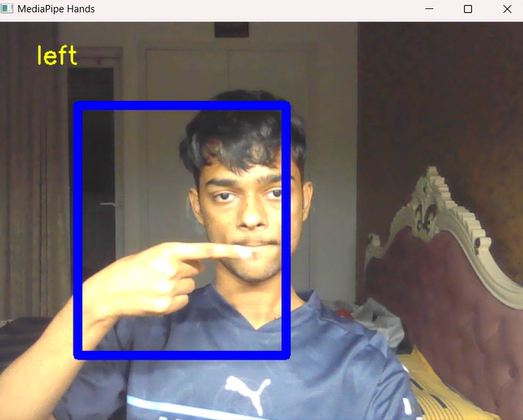
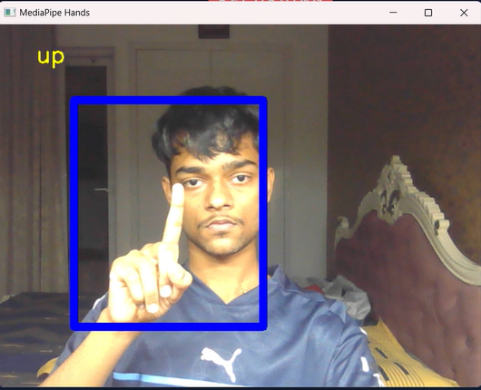
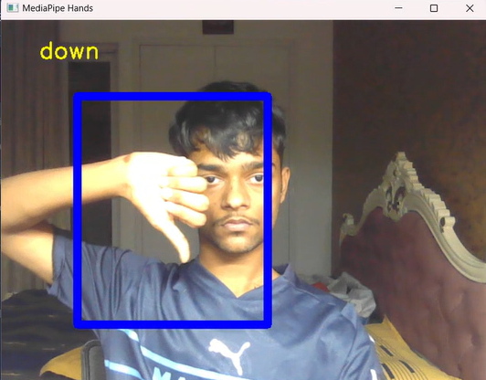

# GestureRecog
Simple neural network trained on Mediapipe Hands landmark coordinates to identify hand gestures

[View the Jupyter Notebook](https://github.com/irixium/GestureRecog/blob/main/training_and_final_resuts.ipynb)
